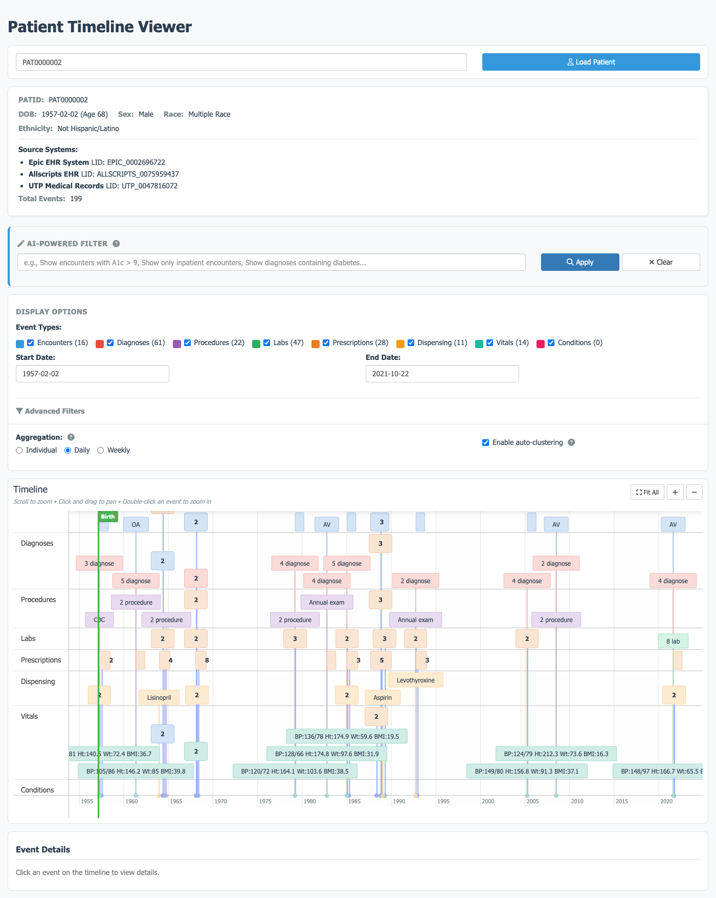

# Patient Timeline Viewer

A Shiny application for viewing a comprehensive temporal overview of a single patient's data from a PCORnet CDM data warehouse. Supports both MS SQL Server and DuckDB backends.

*Screenshot shows synthetic sample data included with the project.*



## Features

-   **Demographics Display**: Shows patient information including PATID, DOB, age, sex, race, ethnicity, and source systems
-   **Interactive Timeline**: Visual timeline of all clinical events using the timevis library
-   **Multiple Event Types**: Encounters, Diagnoses, Procedures, Labs, Prescriptions, Dispensing, Vitals, Conditions, and Death
-   **AI-Powered Semantic Filtering** (Optional): Use natural language queries like "Show statins" or "Show encounters with A1c \> 9 to filter patient data
-   **Aggregation Options**: View events individually, aggregated by day, or by week
-   **Automatic Clustering:** Automatically cluster events as you zoom in and out of the timeline
-   **Filtering**: Filter by event type, date range, diagnosis codes, procedure codes, lab names, and medication names
-   **Event Details**: Click any event to view complete record details
-   **Related Events**: For encounters, quickly zoom to see all events during that visit
-   **Dual Database Support**: Works with MS SQL Server (production) or DuckDB (development/testing)

## Event Type Color Scheme

| Event Type  | Color     | Hex     |
|-------------|-----------|---------|
| Encounters  | Blue      | #3498db |
| Diagnoses   | Coral     | #e74c3c |
| Procedures  | Purple    | #9b59b6 |
| Labs        | Green     | #27ae60 |
| Prescribing | Orange    | #e67e22 |
| Dispensing  | Amber     | #f39c12 |
| Vitals      | Teal      | #1abc9c |
| Conditions  | Pink      | #e91e63 |
| Death       | Dark Gray | #2c3e50 |

## Requirements

### R Packages

``` r
# Core packages (always required)
install.packages(c(
  "shiny",
  "shinyjs",
  "timevis",
  "dplyr",
  "lubridate",
  "DBI",
  "config",
  "htmltools",
  "stringr"
))

# For MS SQL Server
install.packages("odbc")

# For DuckDB
install.packages("duckdb")

# For AI-Powered Semantic Filtering (optional)
install.packages("httr2")
```

### Database Options

#### Option 1: MS SQL Server (Production)

-   Microsoft SQL Server
-   Pre-configured ODBC Data Source Name (DSN)
-   Access to:
    -   CDW database with PCORnet CDM tables
    -   MasterPatientIndex database (optional, for source system mapping)

#### Option 2: DuckDB (Development/Testing)

-   DuckDB database file(s) with PCORnet CDM schema
-   No external database server required
-   Great for local development and testing with sample data

## Configuration

Update `config.yml` to configure your database connection:

### For MS SQL Server

Replace dsn with the Data Source Name configured on your Windows account

``` yaml
default:
  db_type: "mssql"
  
  mssql:
    cdw:
      dsn: "SQLODBCD17CDM"
      database: "CDW"
    mpi:
      dsn: "SQLODBCD17CDM"
      database: "MasterPatientIndex"
```

### For DuckDB

Uses supplied synthetic data.

``` yaml
default:
  db_type: "duckdb"
  
  duckdb:
    cdw_path: "./data/cdw.duckdb"
    mpi_path: "./data/mpi.duckdb"
```

### Using Configuration Profiles

You can define multiple profiles and switch between them:

``` yaml
default:
  db_type: "duckdb"
  duckdb:
    cdw_path: "./data/cdw.duckdb"
    mpi_path: "./data/mpi.duckdb"

production:
  db_type: "mssql"
  mssql:
    cdw:
      dsn: "SQLODBCD17CDM"
      database: "CDW"
    mpi:
      dsn: "SQLODBCD17CDM"
      database: "MasterPatientIndex"
```

To use a specific profile, set the `R_CONFIG_ACTIVE` environment variable:

``` r
Sys.setenv(R_CONFIG_ACTIVE = "production")
shiny::runApp()
```

## AI-Powered Semantic Filtering (Optional Feature) {#ai-powered-semantic-filtering-optional-feature}

The application includes an optional AI-powered semantic filtering feature that lets you query patient data using natural language instead of manual filters.

### Setup

#### 1. Install Required Package

``` r
install.packages("httr2")
```

#### 2. Get an Anthropic API Key

1.  Sign up at <https://www.anthropic.com>
2.  Navigate to API settings
3.  Generate a new API key

#### 3. Set the API Key

**Option A: Using `.Renviron` file (Recommended for development)**

Create or edit `~/.Renviron` in your home directory:

``` bash
ANTHROPIC_API_KEY=sk-ant-api03-your-key-here
```

Then restart R/RStudio.

**Option B: Set in R session**

``` r
Sys.setenv(ANTHROPIC_API_KEY = "sk-ant-api03-your-key-here")
shiny::runApp()
```

**Option C: System environment variable**

On Mac/Linux, add to `~/.bashrc` or `~/.zshrc`:

``` bash
export ANTHROPIC_API_KEY=sk-ant-api03-your-key-here
```

On Windows, set via System Properties → Environment Variables.

#### 4. Configure Model (Optional)

By default, the semantic filter uses `claude-sonnet-4-20250514`. To use a different model, edit `R/semantic_filter.R` line 99:

``` r
# Available models:
# - claude-sonnet-4-20250514 (default, best balance of speed and accuracy)
# - claude-opus-4-20250514 (highest accuracy, slower, more expensive)
# - claude-haiku-4-20250514 (fastest, cheapest, less accurate)

model = "claude-sonnet-4-20250514",  # Change this line
```

**Model comparison:**

| Model  | Speed  | Accuracy  | Cost   | Best For                          |
|--------|--------|-----------|--------|-----------------------------------|
| Haiku  | Fast   | Good      | \$     | Simple queries, high volume       |
| Sonnet | Medium | Excellent | \$\$   | General use (default)             |
| Opus   | Slow   | Best      | \$\$\$ | Complex queries, maximum accuracy |

### Usage

Once configured, you'll see an "AI-Powered Filter" panel at the top of the application. Enter natural language queries like:

-   "Show statins"
-   "Show encounters with A1c \> 9"
-   "Show only inpatient encounters"
-   "Show diagnoses containing diabetes"
-   "Show prescriptions for metformin"
-   "Show labs where result was abnormal"

Click "Apply" to execute the query. The generated SQL will be shown in a collapsible panel for transparency.

### Cost Considerations

Each semantic query makes one API call to Anthropic: - **Typical cost**: \$0.003-\$0.01 USD per query.

**Model pricing**: Check current rates at <https://www.anthropic.com/pricing>

For budget control, consider: - Using Haiku model for routine queries - Monitoring API usage in your Anthropic console - Setting up usage alerts

### Disabling Semantic Filtering

The feature is optional. If `ANTHROPIC_API_KEY` is not set, the application will show a warning at startup but will continue to work normally with all other features available. The AI-Powered Filter panel will still appear but will show an error if used without the API key.

## Project Structure

```         
PatientTimelineViewer/
├── app.R                         # Main Shiny application
├── R/
│   ├── db_queries.R              # SQL queries for each PCORnet table
│   ├── data_transforms.R         # Convert query results → timevis format
│   ├── aggregation.R             # Aggregation logic (none/daily/weekly)
│   ├── filter_helpers.R          # Filtering functions
│   ├── semantic_filter.R         # AI-powered semantic filtering (optional)
│   └── pcornet_schema.txt        # PCORnet schema for AI context
├── config.yml                    # Database connection parameters
├── www/
│   └── custom.css                # Color scheme and styling
├── data/                         # (Optional) DuckDB database files
│   ├── cdw.duckdb
│   └── mpi.duckdb
├── README.md                     # This file
└── SEMANTIC_FILTER_README.md     # Detailed semantic filter documentation
```

## Usage

1.  Open the project in RStudio
2.  Update `config.yml` with your database settings
3.  Run the application:

``` r
shiny::runApp()
```

4.  Enter a PATID in the input field and click "Load Patient"
5.  Use the timeline controls to explore the patient's clinical history

## Creating a DuckDB Test Database

To create a DuckDB database with the PCORnet CDM schema for testing:

``` r
library(duckdb)
library(DBI)

# Create database
con <- dbConnect(duckdb(), "data/cdw.duckdb")

# Create tables (example for DEMOGRAPHIC)
dbExecute(con, "
  CREATE TABLE DEMOGRAPHIC (
    PATID VARCHAR,
    BIRTH_DATE DATE,
    SEX VARCHAR(2),
    RACE VARCHAR(2),
    HISPANIC VARCHAR(2),
    -- ... other columns
    PRIMARY KEY (PATID)
  )
")

# Insert test data
dbExecute(con, "
  INSERT INTO DEMOGRAPHIC VALUES 
  ('TEST001', '1965-03-15', 'M', '05', 'N', ...)
")

dbDisconnect(con)
```

## Queried PCORnet CDM Tables

-   DEMOGRAPHIC
-   ENCOUNTER
-   DIAGNOSIS
-   PROCEDURES
-   LAB_RESULT_CM
-   PRESCRIBING
-   DISPENSING
-   VITAL
-   CONDITION
-   DEATH
-   DEATH_CAUSE

## Timeline Interactions

-   **Hover**: View tooltip with event details
-   **Click**: Select event to view full record in details panel
-   **Scroll**: Zoom in/out on timeline
-   **Drag**: Pan left/right on timeline
-   **Fit Button**: Zoom to show all events
-   **Show Related Events**: (For encounters) Zoom to encounter date range

## Aggregation Modes

-   **Individual**: Every event shown as its own marker
-   **Daily**: Events of same type on same day collapse into one marker with count
-   **Weekly**: Events grouped by ISO week

## Automatic Clustering

-   After aggregation, clustering automatically combines and separates similar events based on the zoom level of timeline

## Filtering Options

### AI-Powered Semantic Filter (Optional)

If configured with an Anthropic API key, use natural language queries: - "Show statins" - "Show encounters with A1c \> 9" - "Show only inpatient encounters" - "Show diagnoses containing diabetes"

See [AI-Powered Semantic Filtering](#ai-powered-semantic-filtering-optional-feature) section above for setup.

### Advanced Filters

Access via the expandable "Advanced Filters" section:

-   **Diagnosis Code**: SQL LIKE pattern (e.g., `E11%` for diabetes)
-   **Procedure Code**: SQL LIKE pattern
-   **Lab Name**: Partial text match
-   **Medication Name**: Partial text match
-   **Encounter Type**: Filter by IP, ED, AV, etc.

## Notes

-   Death events are displayed as a special marker spanning the timeline
-   Events after death date remain visible for data quality review
-   Abnormal lab results are highlighted with a warning indicator
-   Prescription end dates are calculated from days supply if not explicitly provided

## Troubleshooting

### MS SQL Server Connection Issues

-   Verify your ODBC DSN is configured: Check ODBC Data Source Administrator
-   Test connection in R: `DBI::dbConnect(odbc::odbc(), "SQLODBCD17CDM")`
-   Verify you can access the database: `DBI::dbExecute(con, "USE CDW")`
-   Check firewall rules for SQL Server port (default 1433)

### DuckDB Issues

-   Verify database file exists at the configured path
-   Check file permissions (read access required)
-   Test connection: `DBI::dbConnect(duckdb::duckdb(), "path/to/db.duckdb")`

### Missing Patient Data

-   Verify PATID exists in DEMOGRAPHIC table
-   Check that the PATID format matches your system's convention
-   Some source system mappings may not be available in MPI

### "Package not installed" Errors

Make sure you have the appropriate database driver package installed:

``` r
# For MS SQL Server
install.packages("odbc")

# For DuckDB
install.packages("duckdb")

# For semantic filtering
install.packages("httr2")
```

### Semantic Filter Issues

**"ANTHROPIC_API_KEY environment variable not set"** - Set the API key as described in the [AI-Powered Semantic Filtering](#ai-powered-semantic-filtering-optional-feature) section - Restart R/RStudio after setting it in `.Renviron`

**"Claude API error: ..."** - Check your API key is valid - Verify internet connectivity - Check Anthropic API status at <https://status.anthropic.com>

**Generated SQL returns no results** - View the generated SQL to understand what was queried - Try rephrasing your query more specifically - Use advanced filters as an alternative

## License

Internal use only. Developed for clinical data warehouse visualization.
