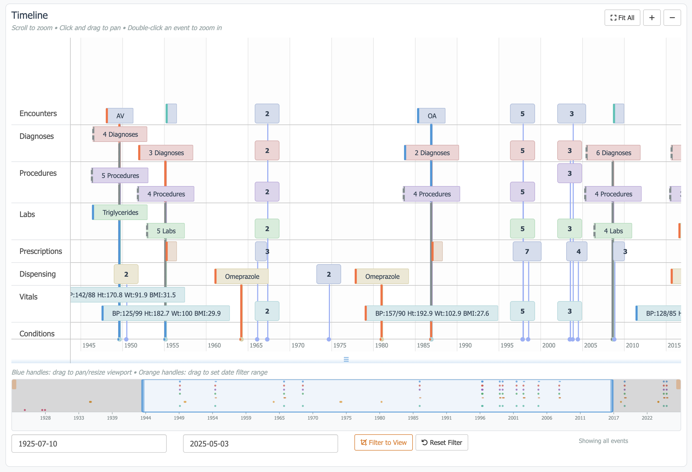

# Patient Timeline Viewer

An R package and Shiny application for viewing a comprehensive temporal overview of a single patient's data from a PCORnet CDM data warehouse. Supports both MS SQL Server and DuckDB backends.

*Screenshot shows synthetic sample data included with the package.*



## Installation

``` r
# Install from GitHub
remotes::install_github("tjohnson250/PatientTimelineViewer")
```

## Quick Start

``` r
library(PatientTimelineViewer)

# Launch the interactive timeline viewer app with sample data
runExample()
```

The package includes synthetic sample data, so you can explore the functionality immediately after installation.

## Database Connection Options

There are four ways to connect the timeline viewer to a database:

### Option 1: Sample Data (Default)

The simplest approach - uses the bundled synthetic DuckDB sample data:

``` r
library(PatientTimelineViewer)
runExample()
```

### Option 2: Pass Your Own Connections

Best for Quarto documents or programmatic use where you already have database connections established:

``` r
library(PatientTimelineViewer)
library(DBI)
library(odbc)

# Create two connections from the same DSN, each set to a different database
# Replace "MY_DSN" with your ODBC Data Source Name
# Replace "CDW" and "MasterPatientIndex" with your actual database names
cdw <- dbConnect(odbc(), "MY_DSN")
DBI::dbExecute(cdw, "USE CDW")

mpi <- dbConnect(odbc(), "MY_DSN")
DBI::dbExecute(mpi, "USE MasterPatientIndex")

# Launch the viewer with both connections (runs in background by default for MSSQL)
viewTimeline(cdw_conn = cdw, mpi_conn = mpi, db_type = "mssql")

# Or without MPI if you don't need source system info
viewTimeline(cdw_conn = cdw, db_type = "mssql")

# Stop the background viewer when done
stopViewer()
```

**For DuckDB connections:**

``` r
library(PatientTimelineViewer)
library(DBI)
library(duckdb)

cdw <- dbConnect(duckdb(), "path/to/cdw.duckdb")
mpi <- dbConnect(duckdb(), "path/to/mpi.duckdb")

# DuckDB always runs in blocking mode due to file locking constraints
# The app will block your R session until closed
viewTimeline(cdw_conn = cdw, mpi_conn = mpi, db_type = "duckdb")
```

**Using bundled sample data with viewTimeline():**

If you want to use `viewTimeline()` with the bundled sample data (instead of `runExample()`), use `get_sample_data_path()` to get the paths:

``` r
library(PatientTimelineViewer)
library(DBI)
library(duckdb)

# Get paths to bundled sample databases
cdw <- dbConnect(duckdb(), get_sample_data_path("cdw"))
mpi <- dbConnect(duckdb(), get_sample_data_path("mpi"))

# Launch with sample data
viewTimeline(cdw_conn = cdw, mpi_conn = mpi, db_type = "duckdb")
```

The `viewTimeline()` function accepts:
- `cdw_conn`: DBI connection to the CDW (PCORnet CDM) database (required)
- `mpi_conn`: DBI connection to the MPI (Master Patient Index) database (optional)
- `db_type`: Either "mssql" or "duckdb"
- `background`: For MSSQL, defaults to TRUE (non-blocking). Ignored for DuckDB (always FALSE).

**About the MPI connection:** The MPI database contains source system mappings (tables: `Mpi`, `MPI_Src`) that show which source systems contributed data for a patient. If you don't have an MPI database or don't need this information, you can pass `NULL` for `mpi_conn` - the app will work normally but won't display source system information in the demographics panel.

**Note:** For MSSQL connections with `background = TRUE`, connections you pass to `viewTimeline()` are not closed when the app exits - you manage their lifecycle. For DuckDB or `background = FALSE`, the app uses your connections directly.

### Option 3: Custom config.yml with R_CONFIG_FILE

Point to your own configuration file before launching:

``` r
library(PatientTimelineViewer)

# Point to your config file
Sys.setenv(R_CONFIG_FILE = "/path/to/your/config.yml")

# Launch the app
runExample()
```

### Option 4: Clone and Run Directly

Clone the repository and run the Shiny app directly, using the local `config.yml`:

``` bash
git clone https://github.com/tjohnson250/PatientTimelineViewer.git
cd PatientTimelineViewer
```

Edit `config.yml` with your database settings, then:

``` r
shiny::runApp()
```

## Features

-   **Demographics Display**: Shows patient information including PATID, DOB, age, sex, race, ethnicity, and source systems
-   **Interactive Timeline**: Visual timeline of all clinical events using the timevis library
-   **Multiple Event Types**: Encounters, Diagnoses, Procedures, Labs, Prescriptions, Dispensing, Vitals, Conditions, and Death
-   **PATID Autocomplete**: Type-ahead search with debounced input - start typing a PATID (min 2 characters) to see matching patients with DOB/sex details
-   **ICD Code Descriptions**: Automatic lookup of ICD-10-CM and ICD-9-CM code descriptions on diagnosis events using bundled official CDC/CMS lookup tables
-   **AI-Powered Semantic Filtering** (Optional): Use natural language queries like "Show statins" or "Show encounters with A1c > 9" to filter patient data
-   **Compact Display & Filters Panel**: All controls consolidated into a single panel — AI filter, event type checkboxes, source system checkboxes, color scheme, aggregation, clustering, labels, and advanced filters
-   **Aggregation Options**: View events individually, aggregated by day, or by week
-   **Automatic Clustering**: Automatically cluster events as you zoom in and out of the timeline
-   **Color Scheme Selector**: Toggle between coloring events by Event Type or by Source System
-   **Source System Filtering**: Filter events by contributing source system with colored visual indicators
-   **Timeline Overview Minimap**: A miniature overview of the full timeline with a draggable viewport and orange filter range handles for quick date navigation
-   **Event Label Toggle**: Show or hide text labels on timeline markers; when hidden, point events collapse to compact dots
-   **Resizable Timeline**: Drag the bottom edge of the timeline pane to adjust its height
-   **Filtering**: Filter by event type, source system, date range, encounter type, diagnosis codes, procedure codes, lab names, and medication names
-   **Event Details**: Click any event to view complete record details
-   **Related Events**: For encounters, quickly zoom to see all events during that visit
-   **Loading Progress Indicator**: Step-by-step progress tracking when loading patient data
-   **Dual Database Support**: Works with MS SQL Server (production) or DuckDB (development/testing)

## Event Type Color Scheme

Events use a muted 8-hue palette with hues spaced ~45° apart for maximum distinguishability:

| Event Type  | Hue       | Background | Border  |
|-------------|-----------|------------|---------|
| Encounters  | Blue      | #d4dded    | #a9bbdb |
| Diagnoses   | Red       | #f0d4d4    | #dba9a9 |
| Procedures  | Purple    | #ded4ed    | #bda9db |
| Labs        | Green     | #d4eddb    | #a9dbb8 |
| Prescribing | Orange    | #edded4    | #dbbda9 |
| Dispensing  | Gold      | #ede8d4    | #dbd1a9 |
| Vitals      | Cyan      | #d4ebed    | #a9d7db |
| Conditions  | Magenta   | #edd4e7    | #dba9cf |
| Death       | Gray      | #d5d8dc    | #85929e |

## Requirements

### For MS SQL Server connections

``` r
install.packages("odbc")
```

### For DuckDB connections (included sample data)

``` r
install.packages("duckdb")
```

### For ICD Code Descriptions

The package includes normalized ICD-10-CM and ICD-9-CM diagnosis lookup tables in `inst/extdata/`. Use `tools/update_icd_lookups.R` to regenerate them from official CDC/CMS downloads and `tools/check_icd_lookup_freshness.R` to verify checksums and detect newer CDC ICD-10-CM releases.

### For AI-Powered Semantic Filtering (optional)

``` r
install.packages("httr2")
```

### Database Options

#### Option 1: MS SQL Server (Production)

-   Microsoft SQL Server
-   Pre-configured ODBC Data Source Name (DSN)
-   Access to:
    -   CDW database with PCORnet CDM tables
    -   MasterPatientIndex database (optional, for source system mapping)

#### Option 2: DuckDB (Development/Testing)

-   DuckDB database file(s) with PCORnet CDM schema
-   No external database server required
-   Great for local development and testing with sample data

## Configuration

Update `config.yml` to configure your database connection:

### For MS SQL Server

Replace dsn with the Data Source Name configured on your Windows account

``` yaml
default:
  db_type: "mssql"
  
  mssql:
    cdw:
      dsn: "SQLODBCD17CDM"
      database: "CDW"
    mpi:
      dsn: "SQLODBCD17CDM"
      database: "MasterPatientIndex"
```

### For DuckDB

Uses supplied synthetic data.

``` yaml
default:
  db_type: "duckdb"
  
  duckdb:
    cdw_path: "./inst/extdata/pcornet_cdw.duckdb"
    mpi_path: "./inst/extdata/mpi.duckdb"
```

### Using Configuration Profiles

You can define multiple profiles and switch between them:

``` yaml
default:
  db_type: "duckdb"
  duckdb:
    cdw_path: "./inst/extdata/pcornet_cdw.duckdb"
    mpi_path: "./inst/extdata/mpi.duckdb"

production:
  db_type: "mssql"
  mssql:
    cdw:
      dsn: "SQLODBCD17CDM"
      database: "CDW"
    mpi:
      dsn: "SQLODBCD17CDM"
      database: "MasterPatientIndex"
```

To use a specific profile, set the `R_CONFIG_ACTIVE` environment variable:

``` r
Sys.setenv(R_CONFIG_ACTIVE = "production")
shiny::runApp()
```

## AI-Powered Semantic Filtering (Optional Feature)

The application includes an optional AI-powered semantic filtering feature that lets you query patient data using natural language instead of manual filters.

### Setup

#### 1. Install Required Package

``` r
install.packages("httr2")
```

#### 2. Get an Anthropic API Key

1.  Sign up at <https://www.anthropic.com>
2.  Navigate to API settings
3.  Generate a new API key

#### 3. Set the API Key

**Option A: Using `.Renviron` file (Recommended for development)**

Create or edit `~/.Renviron` in your home directory:

``` bash
ANTHROPIC_API_KEY=sk-ant-api03-your-key-here
```

Then restart R/RStudio.

**Option B: Set in R session**

``` r
Sys.setenv(ANTHROPIC_API_KEY = "sk-ant-api03-your-key-here")
shiny::runApp()
```

**Option C: System environment variable**

On Mac/Linux, add to `~/.bashrc` or `~/.zshrc`:

``` bash
export ANTHROPIC_API_KEY=sk-ant-api03-your-key-here
```

On Windows, set via System Properties → Environment Variables.

#### 4. Configure Model (Optional)

By default, the semantic filter uses `claude-sonnet-4-20250514`. To use a different model, edit `R/semantic_filter.R` line 99:

``` r
# Available models:
# - claude-sonnet-4-20250514 (default, best balance of speed and accuracy)
# - claude-opus-4-20250514 (highest accuracy, slower, more expensive)
# - claude-haiku-4-20250514 (fastest, cheapest, less accurate)

model = "claude-sonnet-4-20250514",  # Change this line
```

**Model comparison:**

| Model  | Speed  | Accuracy  | Cost   | Best For                          |
|--------|--------|-----------|--------|-----------------------------------|
| Haiku  | Fast   | Good      | \$     | Simple queries, high volume       |
| Sonnet | Medium | Excellent | \$\$   | General use (default)             |
| Opus   | Slow   | Best      | \$\$\$ | Complex queries, maximum accuracy |

### Usage

Once configured, the AI filter input appears in the "Display & Filters" panel at the top row. Enter natural language queries like:

-   "Show statins"
-   "Show encounters with A1c \> 9"
-   "Show only inpatient encounters"
-   "Show diagnoses containing diabetes"
-   "Show prescriptions for metformin"
-   "Show labs where result was abnormal"

Click "Apply" to execute the query. The generated SQL will be shown in a collapsible panel for transparency.

### Cost Considerations

Each semantic query makes one API call to Anthropic: - **Typical cost**: \$0.003-\$0.01 USD per query.

**Model pricing**: Check current rates at <https://www.anthropic.com/pricing>

For budget control, consider: - Using Haiku model for routine queries - Monitoring API usage in your Anthropic console - Setting up usage alerts

### Disabling Semantic Filtering

The feature is optional. If `ANTHROPIC_API_KEY` is not set, the application will show a warning at startup but will continue to work normally with all other features available. The AI-Powered Filter panel will still appear but will show an error if used without the API key.

## Project Structure

```
PatientTimelineViewer/
├── app.R                         # Development entry point (sources modules)
├── R/
│   ├── app_ui_server.R           # Single source of truth for UI + server logic
│   ├── db_queries.R              # SQL queries for each PCORnet table
│   ├── data_transforms.R         # Convert query results → timevis format
│   ├── aggregation.R             # Aggregation logic (none/daily/weekly)
│   ├── filter_helpers.R          # Filtering functions
│   ├── semantic_filter.R         # AI-powered semantic filtering (optional)
│   ├── icd_lookup.R              # ICD-10/ICD-9 code description lookups
│   ├── runExample.R              # Package interface (runExample, viewTimeline)
│   ├── globals.R                 # Global variable declarations
│   ├── PatientTimelineViewer-package.R  # Package documentation
│   └── pcornet_schema.txt        # PCORnet schema for AI context
├── config.yml                    # Database connection parameters
├── www/
│   ├── custom.css                # Color scheme and styling
│   ├── cluster-colors.js         # Cluster color management
│   ├── timeline-markers.js       # Timeline marker manipulation
│   ├── timeline-resizer.js       # Draggable timeline resize handle
│   └── timeline-overview.js      # Minimap/overview panel logic
├── inst/extdata/                  # Bundled sample data
│   ├── pcornet_cdw.duckdb        # Synthetic CDW database
│   ├── mpi.duckdb                # Synthetic MPI database
│   └── pcornet_schema.txt        # PCORnet schema for semantic filter
├── vignettes/
│   └── getting-started.qmd       # Getting started vignette
├── tests/testthat/               # Unit tests
│   ├── test-aggregation.R
│   ├── test-filters.R
│   └── test-transforms.R
├── README.md                     # This file
└── SEMANTIC_FILTER_README.md     # Detailed semantic filter documentation
```

## Usage

1.  Open the project in RStudio
2.  Update `config.yml` with your database settings
3.  Run the application:

``` r
shiny::runApp()
```

4.  Start typing a PATID in the search field (autocomplete suggestions appear after 2 characters) and click "Load Patient"
5.  Use the timeline controls, minimap, and filters to explore the patient's clinical history

## Creating a DuckDB Test Database

To create a DuckDB database with the PCORnet CDM schema for testing:

``` r
library(duckdb)
library(DBI)

# Create database
con <- dbConnect(duckdb(), "inst/extdata/pcornet_cdw.duckdb")

# Create tables (example for DEMOGRAPHIC)
dbExecute(con, "
  CREATE TABLE DEMOGRAPHIC (
    PATID VARCHAR,
    BIRTH_DATE DATE,
    SEX VARCHAR(2),
    RACE VARCHAR(2),
    HISPANIC VARCHAR(2),
    -- ... other columns
    PRIMARY KEY (PATID)
  )
")

# Insert test data
dbExecute(con, "
  INSERT INTO DEMOGRAPHIC VALUES 
  ('TEST001', '1965-03-15', 'M', '05', 'N', ...)
")

dbDisconnect(con)
```

## Queried PCORnet CDM Tables

-   DEMOGRAPHIC
-   ENCOUNTER
-   DIAGNOSIS
-   PROCEDURES
-   LAB_RESULT_CM
-   PRESCRIBING
-   DISPENSING
-   VITAL
-   CONDITION
-   DEATH
-   DEATH_CAUSE

## Timeline Interactions

-   **Hover**: View tooltip with event details
-   **Click**: Select event to view full record in details panel
-   **Scroll**: Zoom in/out on timeline
-   **Drag**: Pan left/right on timeline
-   **Fit All Button**: Zoom to show all events
-   **Show Related Events**: (For encounters) Zoom to encounter date range
-   **Overview Minimap**: Drag the viewport rectangle to pan; drag orange handles to set filter date range
-   **Resize Handle**: Drag the bottom edge of the timeline to adjust height
-   **Label Toggle**: Use the "Show event labels" checkbox to toggle text on/off markers

## Aggregation Modes

-   **Individual**: Every event shown as its own marker
-   **Daily**: Events of same type on same day collapse into one marker with count
-   **Weekly**: Events grouped by ISO week

## Automatic Clustering

-   After aggregation, clustering automatically combines and separates similar events based on the zoom level of timeline

## Filtering Options

### Event Type Checkboxes

Toggle visibility of each event type (Encounters, Diagnoses, Procedures, Labs, etc.) using checkboxes with event counts.

### Source System Filter

When a patient has data from multiple source systems, checkboxes appear to filter by contributing system. Events display colored left-border indicators showing their source.

### Date Range

Filter events to a specific date range using the date inputs or by dragging the orange filter range handles on the minimap.

### AI-Powered Semantic Filter (Optional)

If configured with an Anthropic API key, use natural language queries:

-   "Show statins"
-   "Show encounters with A1c > 9"
-   "Show only inpatient encounters"
-   "Show diagnoses containing diabetes"

See [AI-Powered Semantic Filtering](#ai-powered-semantic-filtering-optional-feature) section above for setup.

### Advanced Filters

Access via the expandable "Advanced Filters" section:

-   **Diagnosis Code**: SQL LIKE pattern (e.g., `E11%` for diabetes)
-   **Procedure Code**: SQL LIKE pattern
-   **Lab Name**: Partial text match
-   **Medication Name**: Partial text match
-   **Encounter Type**: Filter by IP, ED, AV, etc.

## Display & Filters Panel

All display controls are consolidated into a single compact panel with three rows:

-   **Row 1**: AI filter input with Apply/Clear buttons, Color By dropdown (Event Type or Source System)
-   **Row 2**: Event type checkboxes (3-column grid with colored indicator squares), Source system checkboxes (with colored indicator squares matching left-border colors)
-   **Row 3**: Aggregation (Individual/Daily/Weekly), auto-clustering toggle, event label toggle, collapsible Advanced Filters

The colored squares on event type checkboxes serve as the color legend. A separate legend is only shown when Color By is set to "Source System".

## Notes

-   Death events are displayed as a special marker spanning the timeline
-   Events after death date remain visible for data quality review
-   Abnormal lab results are highlighted with a warning indicator
-   Prescription end dates are calculated from days supply if not explicitly provided
-   ICD-10 and ICD-9 diagnosis code descriptions are automatically displayed from bundled official CDC/CMS lookup tables

## Troubleshooting

### MS SQL Server Connection Issues

-   Verify your ODBC DSN is configured: Check ODBC Data Source Administrator
-   Test connection in R: `DBI::dbConnect(odbc::odbc(), "SQLODBCD17CDM")`
-   Verify you can access the database: `DBI::dbExecute(con, "USE CDW")`
-   Check firewall rules for SQL Server port (default 1433)

### DuckDB Issues

-   Verify database file exists at the configured path
-   Check file permissions (read access required)
-   Test connection: `DBI::dbConnect(duckdb::duckdb(), "path/to/db.duckdb")`

### Missing Patient Data

-   Verify PATID exists in DEMOGRAPHIC table
-   Check that the PATID format matches your system's convention
-   Some source system mappings may not be available in MPI

### "Package not installed" Errors

Make sure you have the appropriate database driver package installed:

``` r
# For MS SQL Server
install.packages("odbc")

# For DuckDB
install.packages("duckdb")

# For semantic filtering
install.packages("httr2")
```

### Semantic Filter Issues

**"ANTHROPIC_API_KEY environment variable not set"** - Set the API key as described in the [AI-Powered Semantic Filtering](#ai-powered-semantic-filtering-optional-feature) section - Restart R/RStudio after setting it in `.Renviron`

**"Claude API error: ..."** - Check your API key is valid - Verify internet connectivity - Check Anthropic API status at <https://status.anthropic.com>

**Generated SQL returns no results** - View the generated SQL to understand what was queried - Try rephrasing your query more specifically - Use advanced filters as an alternative

## License

MIT License. See [LICENSE](LICENSE) for details.
